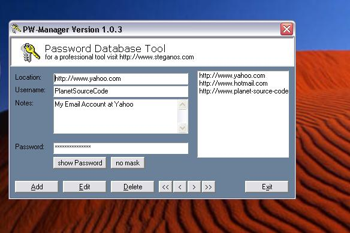



## Password Manager/Database

### Description

Ado Database which stores Usernames, Passwords, Notes. Passwords are kept encrypted. For the Encryption i used the DS2 Class I found on this site.(Author: David Greenwood)So far the best Encryption - Example I could find here.

Uses the Microsoft-Style of Ado Database. Features Add, Update, Delete, Cancel, Edit and a Listbox. See Screenshot!

Update available, More security:

http://www.pscode.com/vb/scripts/ShowCode.asp?txtCodeId=41006&lngWId=1
 
### More Info
 

             |
---                |---
**Submitted On**   |2002-05-08 09:58:54
**By**             |[Ranma Saotome](https://github.com/Planet-Source-Code/PSCIndex/blob/master/ByAuthor/ranma-saotome.md)
**Level**          |Beginner
**User Rating**    |4.6 (23 globes from 5 users)
**Compatibility**  |VB 5\.0, VB 6\.0
**Category**       |[Databases/ Data Access/ DAO/ ADO](https://github.com/Planet-Source-Code/PSCIndex/blob/master/ByCategory/databases-data-access-dao-ado__1-6.md)
**World**          |[Visual Basic](https://github.com/Planet-Source-Code/PSCIndex/blob/master/ByWorld/visual-basic.md)
**Archive File**   |[Password\_M80676582002\.zip](https://github.com/Planet-Source-Code/ranma-saotome-password-manager-database__1-34556/archive/master.zip)

